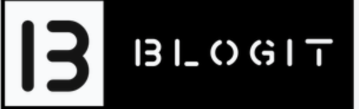

<p align="center">
  
</p>


Blogit is a blog site where users can post about anything that interests them. Users can log in and add new posts, they can be authenticated to edit and change content. Visitors to the site can search for blogs of certain authors or create an account to make blogs themselves.

## Features

**Blog Creation:** Users can easily make blogs. 


## Screenshots

<p align="center">
 
</p>


## Getting started

1. Clone the repo

```
git clone https://github.com/
cd
```

2. Create a `.env` file under `client` directory

```
cd client
touch .env
```

3. Add following variables

`REACT_APP_API_BASE_URL`


4. Create a `.env` file under `server` directory

```
cd server
touch .env
```

5. Add following variables

`BASE_URL`


6. Install dependencies for backend

```
cd server
npm i
```

7. Start development server for backend

```
npm run dev
```

8. Install dependencies for frontend

```
cd client
npm i
```

9. Start development server for frontend

```
npm start
```


## Tech stack

- [React](https://react.dev) - Frontend library for building user interfaces

- [Tailwind](https://tailwindcss.com) - Flexible CSS framework with pre-built classes for quickly styling web applications

- [Axios](https://axios-http.com/docs/intro) - Library for sending HTTP requests in JavaScript

- [React Icons]([React Icons](https://react-icons.github.io/react-icons/)) - Library that offers a collection of ready-to-use icons for React applications

- [Express.js](https://expressjs.com) - Lightweight web framework for Node.js that makes building web applications

- [MongoDB](https://www.mongodb.com) - Flexible and scalable NoSQL database that stores data in a format similar to JSON

- [Mongoose](https://mongoosejs.com) - Object Data Modeling (ODM) library for Node.js and MongoDB

- [JWT](https://jwt.io) - App security with tokens

- [Nodemailer](https://nodemailer.com/about/) - Library for sending emails using Node.js

- [Cypress](https://www.cypress.io) - End-to-end testing framework for web applications

- [Jest](https://jestjs.io) - Testing framework widely used for unit testing applications

- [Postman](https://www.postman.com) - Powerful tool for testing and documenting APIs

- [Prettifier](https://prettier.io) - Tool for making code look neat and organized by automatically adjusting its formatting

- [mongoDB Compass](https://www.mongodb.com/products/compass) - Visual GUI (Graphical User Interface) tool for MongoDB


  
  

## Author

Vipin Devan - [Github](https://github.com/Vipin-Devan) - [LinkedIn](https://www.linkedin.com/in/vipindevan/)

## License

This project is licensed under the MIT License.
